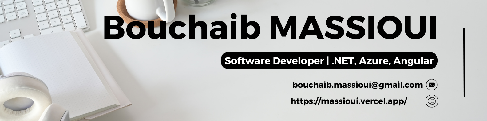

# Hey there! I'm [Massioui](https://massioui.vercel.app/) 👋

  
  
  
  
  

Passionate **.NET | Azure | Angular Software Developer** with a Proven Track Record of Crafting Innovative Solutions.      
With **over 5 years** of hands-on experience in software development, I specialize in leveraging .NET, Azure, and Angular to create efficient and user-friendly applications. My focus is on results, and I'm dedicated to delivering solutions that exceed expectations.

I thrive on refining my core skills in software development, software design, software architecture, and problem-solving. By staying abreast of the latest industry trends and technologies, I ensure that my solutions are always cutting-edge and effective.

🅷🅸🅶🅷🅻🅸🅶🅷🆃 🆂🅺🅸🅻🅻🆂:
- .𝐍𝐄𝐓 𝐒𝐨𝐟𝐭𝐰𝐚𝐫𝐞 𝐄𝐧𝐠𝐢𝐧𝐞𝐞𝐫𝐢𝐧𝐠
- 𝐀𝐧𝐠𝐮𝐥𝐚𝐫 𝐒𝐨𝐟𝐭𝐰𝐚𝐫𝐞 𝐃𝐞𝐯𝐞𝐥𝐨𝐩𝐦𝐞𝐧𝐭
- 𝐀𝐳𝐮𝐫𝐞 𝐒𝐨𝐟𝐭𝐰𝐚𝐫𝐞 𝐃𝐞𝐯𝐞𝐥𝐨𝐩𝐦𝐞𝐧𝐭
- 𝐒𝐨𝐟𝐭𝐰𝐚𝐫𝐞 𝐃𝐞𝐬𝐢𝐠𝐧 𝐚𝐧𝐝 𝐀𝐫𝐜𝐡𝐢𝐭𝐞𝐜𝐭𝐮𝐫𝐞
- 𝐏𝐫𝐨𝐛𝐥𝐞𝐦 𝐒𝐨𝐥𝐯𝐢𝐧𝐠

> I revel in challenges, adept at molding raw concepts into refined, tested solutions that captivate and inspire.

## GitHub Stats

  

## Projects

Here are some notable projects I've worked on:

1. **E-commerce Platform**  
   - Designed and developed a real-world e-commerce microservices project leveraging .NET, SQL Server, Redis, PostgreSQL, RabbitMQ, MassTransit, and Clean Architecture, GitHub: dotnet5-microservices

_Feel free to explore my repositories to see more of my work and don't hesitate to reach out if you have any questions or collaboration opportunities!_

  Thank you for visiting!, and let's code something amazing! 💻✨

